<picture>
  <source media="(prefers-color-scheme: dark)" srcset="assets/header-dark.svg">
  <source media="(prefers-color-scheme: light)" srcset="assets/header-light.svg">
  
</picture>

# Krim

**AI research in the public sector.** Algorithms, techniques and implementations. Academic, and therefore technical to the core.

**Open source.** Development and CI/CD run on my self-hosted Forgejo. GitHub is publish-only, mirrored to Codeberg (my intended long-term home). For most bugs a precise report with a suggested fix helps maintainers more than a PR, so that stays my default; large feature PRs in other projects are rare.

**For fun:** embedded and hardware security. Right now the CDC Badge firmware/OS, together with the CCC's CDC.

Beyond that I run a complete self-hosted stack and act as the IT service for friends and family: privacy-first messaging, mail, storage, VPN and more.

### Elsewhere
- **ZAD**: https://www.uni-giessen.de/zad/
- **LinkedIn**: https://www.linkedin.com/in/chrisuhl/
- **krim.dev**: my self-hosted playground and services

### Contact
<picture>
  <source media="(prefers-color-scheme: dark)" srcset="assets/contact-dark.svg">
  <source media="(prefers-color-scheme: light)" srcset="assets/contact-light.svg">
  
</picture>
